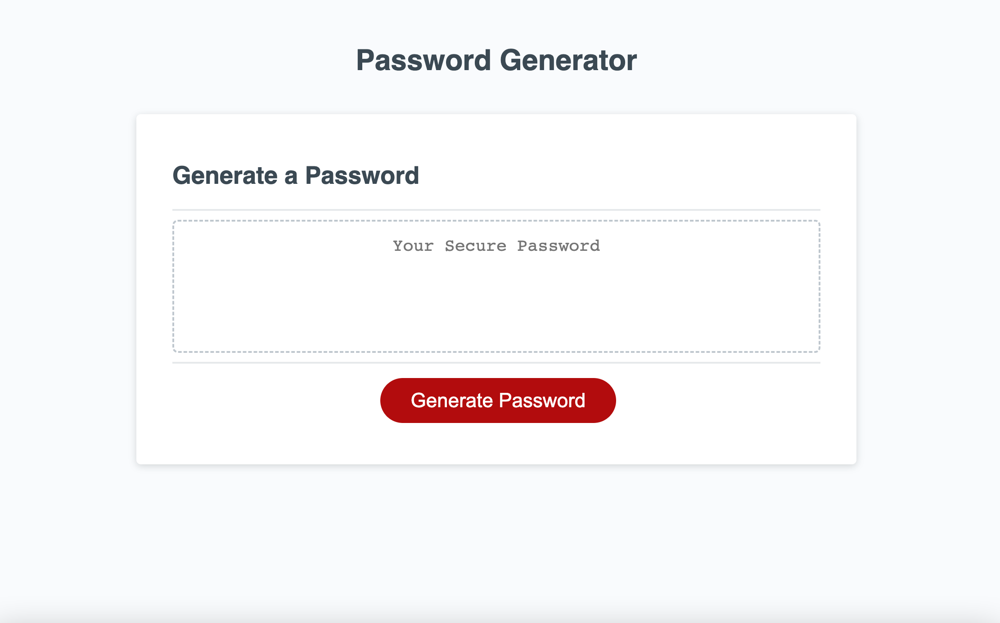

# password-generator

This webpage allows users to choose the criteria for a password which is then generated by the program. The objective of the password generator is to create a password that satisfies the criteria chosen by the user. Through a series of prompts, users can select a password length and the character types to include in the password. The password then generates and appears for the user.

## Link to the Production Version

https://ndockman.github.io/password-generator/

